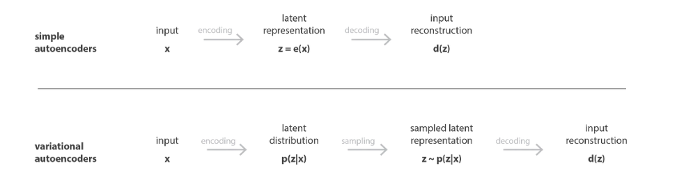
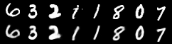
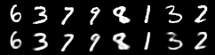
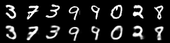
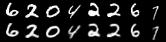
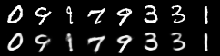
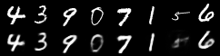
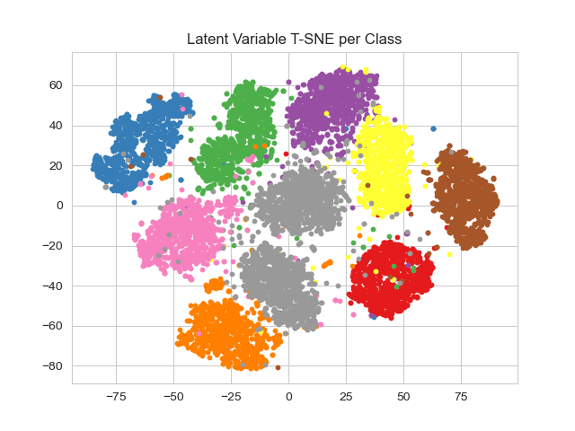

# variational-autoencoder

A <a href="https://pyro.ai/examples/vae.html">Pyro/Pytorch</a> implementation of probabilistic variational autoencoders for MNIST.

IN order to be able to use the decoder of an autoencoder for generative purpose, we have to be sure that the latent space is regular enough. One possible solution to obtain such regularity is to introduce explicit regularisation during the training process. Thus, a variational autoencoder can be defined as being an autoencoder whose training is regularised to avoid overfitting and ensure that the latent space has good properties that enable generative process.

Just as a standard autoencoder, a variational autoencoder is an architecture composed of both an encoder and a decoder and that is trained to minimise the reconstruction error between the encoded-decoded data and the initial data. However, in order to introduce some regularisation of the latent space, we proceed to a slight modification of the encoding-decoding process: instead of encoding an input as a single point, we encode it as a distribution over the latent space. The model is then trained as follows:

- first, the input is encoded as distribution over the latent space
- second, a point from the latent space is sampled from that distribution
- third, the sampled point is decoded and the reconstruction error can be computed
- finally, the reconstruction error is backpropagated through the network

This repository represents a generative model which utilizes VAE impleneted with Pyro deep probabilistic language to regenrate the MNIST images samples pulled from a distribution over the latent space and then compare the extracted features and generated images with the grand truth.

